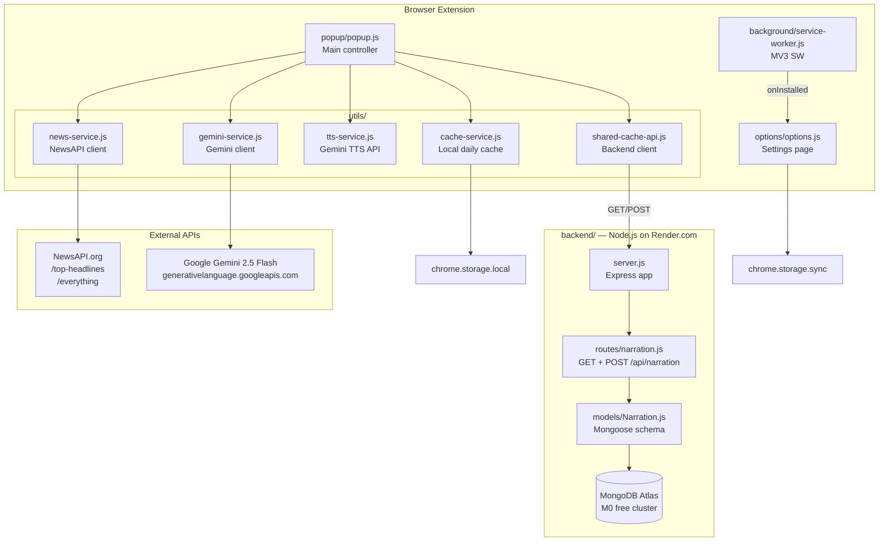
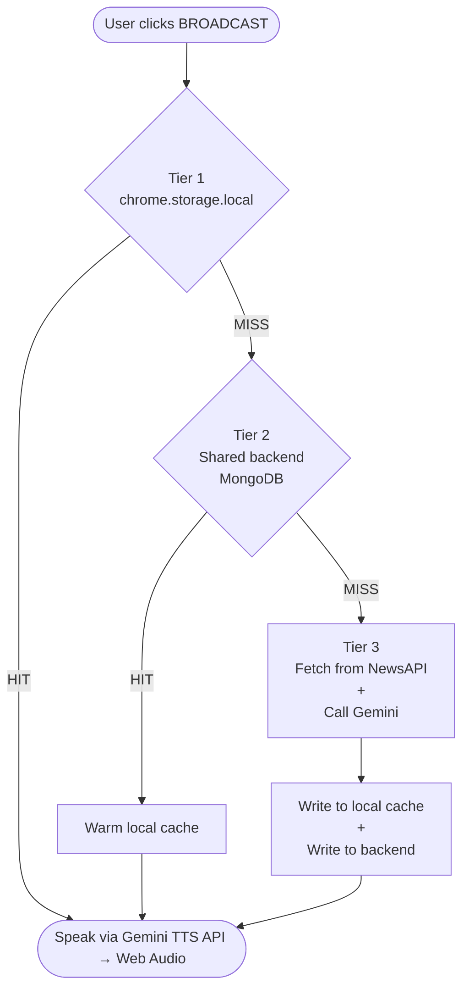

# HeadlineFM — Architecture Overview

## What it is

A **Manifest V3 Chrome extension** that fetches today's top news headlines, sends them to Google Gemini to produce an entertaining narration script, then reads it aloud via the **Gemini TTS API + Web Audio API**. A shared Node.js/MongoDB backend acts as a cross-user daily cache so Gemini is called at most **twice per day** (once per gender/persona).

---

## High-Level Component Map

---

## Layer Breakdown

| Layer | Files | Responsibility |
|-------|-------|----------------|
| **UI Controller** | `popup/popup.js` | Orchestrates everything — reads settings, drives the 3-tier cache lookup, updates the DOM |
| **Settings** | `options/options.js` | Saves/loads API keys and backend URL via `chrome.storage.sync` |
| **Background** | `background/service-worker.js` | Opens options page on first install; otherwise idle |
| **News fetcher** | `utils/news-service.js` | Parallel `Promise.allSettled` fetch across all selected categories |
| **AI narration** | `utils/gemini-service.js` | Builds persona-aware prompt, calls Gemini REST API, returns script |
| **Speech** | `utils/tts-service.js` | Gemini TTS API client — generates audio, decodes PCM, plays via Web Audio API; fixed voices (Aoede / Charon) |
| **Local cache** | `utils/cache-service.js` | `chrome.storage.local` daily cache keyed by `date + categories + gender` |
| **Shared cache client** | `utils/shared-cache-api.js` | HTTP client for the backend; fire-and-forget writes |
| **Backend API** | `backend/server.js` + `routes/narration.js` | Express server: `GET` reads from MongoDB; `POST` writes to MongoDB |
| **DB schema** | `backend/models/Narration.js` | Mongoose model with compound index + 48 h TTL auto-delete |

---

## Anchor Personas

Two distinct AI personalities are configured in `utils/gemini-service.js`:

| Persona | Gender | Character |
|---------|--------|-----------|
| **Maya** | Female | Sharp, warm, Gen-Z, Samantha Bee / Hasan Minhaj energy |
| **Zane** | Male | Dry, deadpan, John Mulaney / tech-Twitter vibe |

Each gender produces a **separate Gemini prompt → separate cache entry**. Switching gender fetches a genuinely different script.

---

## Cache Architecture (3 tiers)

Cache key format: `nr_{YYYY-MM-DD}_{sorted-cats}_{gender}`  
Example: `nr_2026-07-14_finance,technology_female`

---

## Storage Keys Used

| Storage | Key pattern | Value | Scope |
|---------|-------------|-------|-------|
| `chrome.storage.sync` | `newsApiKey` | string | User settings |
| `chrome.storage.sync` | `geminiApiKey` | string | User settings |
| `chrome.storage.sync` | `backendUrl` | string | User settings |
| `chrome.storage.sync` | `writeSecret` | string | User settings |
| `chrome.storage.sync` | `selectedCategories` | string[] | User settings |
| `chrome.storage.sync` | `voiceGender` | `'female'\|'male'` | User settings |
| `chrome.storage.local` | `nr_{date}_{cats}_{gender}` | `{value, ts}` | Daily narration cache |

---

## Permissions Model

Declared in `manifest.json`:

| Permission | Reason |
|-----------|--------|
| `storage` | `chrome.storage.local` + `.sync` for cache and settings |
| `https://newsapi.org/*` | Static — always needed |
| `https://generativelanguage.googleapis.com/*` | Static — always needed |
| `https://*/*` (optional) | User-entered backend URL — requested at runtime via `chrome.permissions.request()` in `options.js` |

---

## Backend API Contract

Base URL: user-configured (e.g. `https://headlinefm.onrender.com`)

| Method | Path | Purpose |
|--------|------|---------|
| `GET` | `/api/narration?date=YYYY-MM-DD&cats=a,b,c&gender=female` | Retrieve cached narration |
| `POST` | `/api/narration` | Store new narration `{date, categories, gender, narration}` |
| `GET` | `/health` | Liveness check |

Rate limits: GET 30 req/min · POST 5 req/min  
Write protection: optional `X-HeadlineFM-Secret` header matched against `WRITE_SECRET` env var.