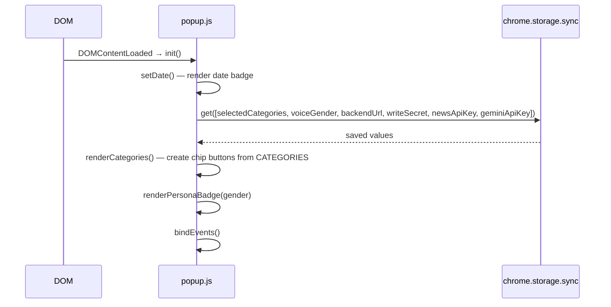
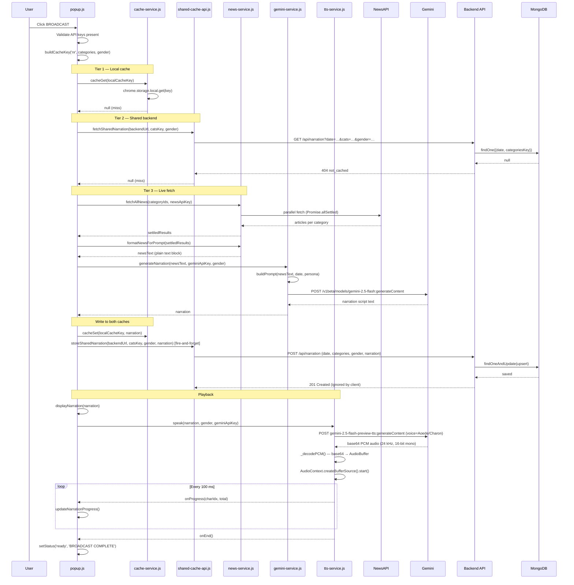
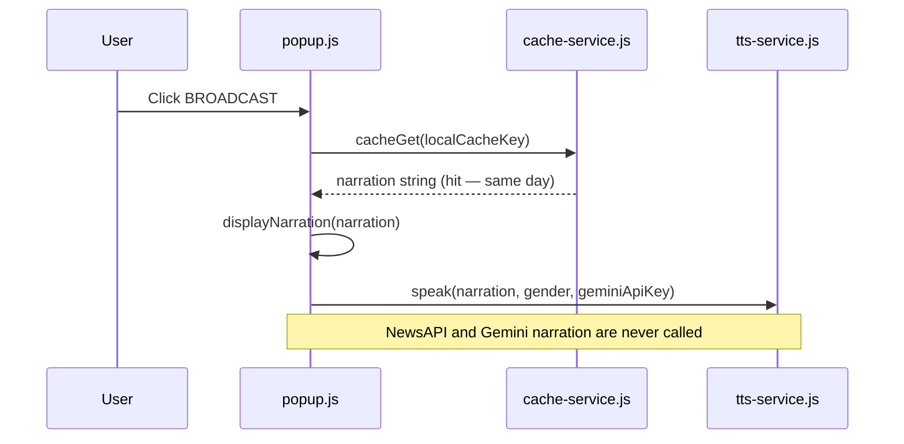
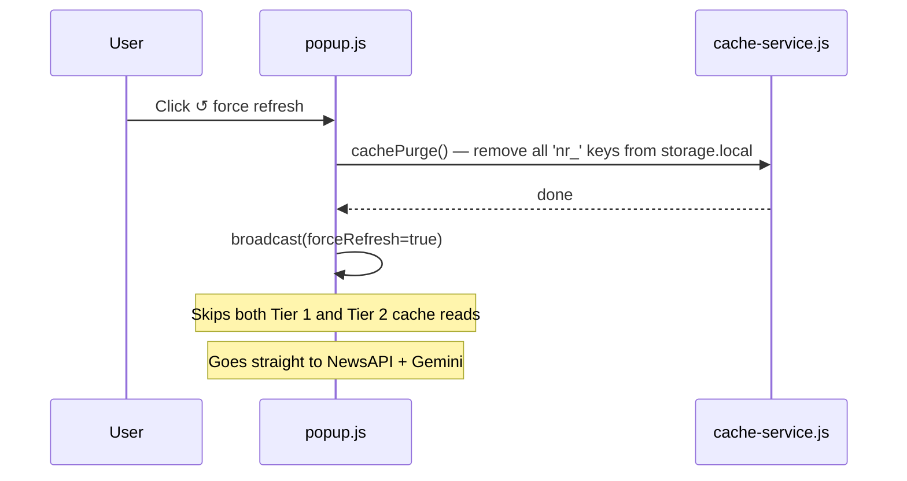
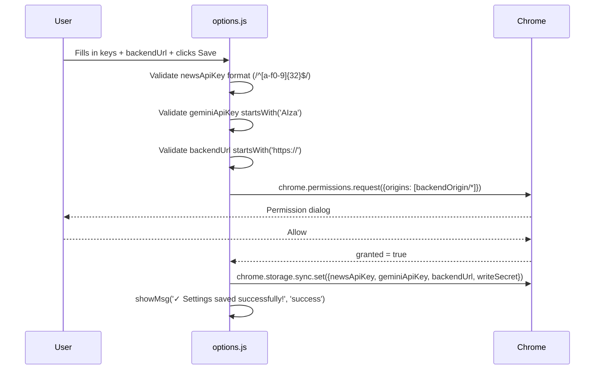
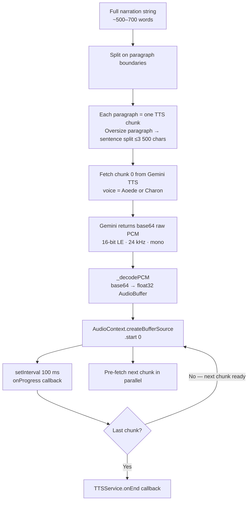
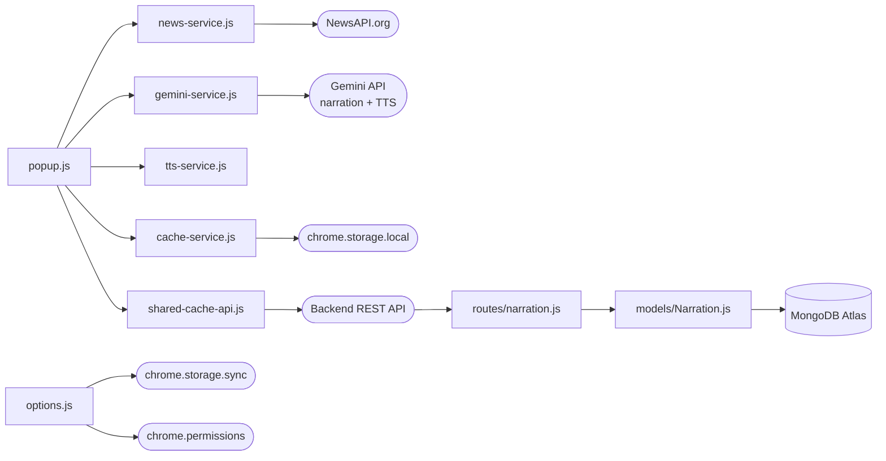

# HeadlineFM — Data & Message Flow

Detailed sequence diagrams showing exactly what happens at runtime.

---

## 1. Extension Install Flow

```mermaid
sequenceDiagram
    participant Chrome
    participant SW as service-worker.js
    participant Options as options.js

    Chrome->>SW: onInstalled (reason='install')
    SW->>Chrome: chrome.runtime.openOptionsPage()
    Chrome->>Options: Open options panel
    Options->>Chrome: chrome.storage.sync.get(keys)
    Chrome-->>Options: {} (empty — first run)
    Note over Options: All fields blank; user pastes API keys
    Options->>Chrome: chrome.permissions.request({origins: [backendUrl/*]})
    Chrome-->>Options: granted=true
    Options->>Chrome: chrome.storage.sync.set({newsApiKey, geminiApiKey, backendUrl, ...})
```

---

## 2. Popup Init Flow



---

## 3. Broadcast Flow — Full (Cache Miss on All Tiers)



---

## 4. Broadcast Flow — Tier 1 Cache Hit (Local)



---

## 5. Broadcast Flow — Tier 2 Cache Hit (Shared Backend)

```mermaid
sequenceDiagram
    participant User
    participant P as popup.js
    participant CS as cache-service.js
    participant SC as shared-cache-api.js
    participant Backend
    participant MongoDB

    User->>P: Click BROADCAST
    P->>CS: cacheGet(localCacheKey) → null
    P->>SC: fetchSharedNarration(backendUrl, catsKey, gender)
    SC->>Backend: GET /api/narration?date=…&cats=…&gender=…
    Backend->>MongoDB: findOne({date, categoriesKey})
    MongoDB-->>Backend: {narration, createdAt}
    Backend-->>SC: 200 {narration}
    SC-->>P: narration string

    P->>CS: cacheSet(localCacheKey, narration)  ← warm local cache
    P->>P: displayNarration + playNarration(text, gender, geminiApiKey)
    Note over P: Gemini narration is never called; NewsAPI is never called
```

---

## 6. Force Refresh Flow



---

## 7. Settings Save Flow (with Optional Host Permission)



---

## 8. Gemini TTS Audio Pipeline

The `TTSService` calls the Gemini TTS API and plays the result through Web Audio API, eliminating the Chrome Web Speech API ~15-second cutoff entirely.



Pipelining: while chunk N is playing, chunk N+1 is already being fetched from Gemini TTS in parallel, so there is no audible gap between paragraphs.

Chunking strategy: `_chunkText()` always splits on `\n\n` paragraph boundaries first. Each paragraph becomes its own TTS call. Any paragraph longer than 3 500 chars is further split at sentence endings. This means even a short narration is chunked by paragraph — the user hears the first paragraph almost immediately while the rest is fetched.

Cancellation: a `_gen` integer is incremented on every `speak()` and `stop()`. Every async step checks `this._gen === gen` before continuing; stale in-flight fetches are silently discarded.

---

## 9. Module Dependency Graph



---

## 10. Data Shapes

### News article (internal)
```js
{
  title: string,
  description: string,    // truncated to 120 chars in prompt
  source: string,
}
```

### Gemini request body (simplified)
```js
{
  contents: [{ parts: [{ text: promptString }] }],
  generationConfig: { temperature: 0.88, topP: 0.92, maxOutputTokens: 8192, thinkingConfig: { thinkingBudget: 0 } },
  safetySettings: [ /* HARASSMENT, HATE_SPEECH, SEXUALLY_EXPLICIT, DANGEROUS_CONTENT — all BLOCK_MEDIUM_AND_ABOVE */ ]
}
```

### Local cache entry
```js
{ value: "narration script...", ts: 1752499200000 }
```

### Backend POST body
```js
{ date: "2026-07-14", categories: "finance,technology", gender: "female", narration: "..." }
```

### Backend GET response (200)
```js
{ narration: "...", date: "2026-07-14", categoriesKey: "finance,technology_female", gender: "female", cachedAt: "2026-07-14T..." }
```

### MongoDB document (Narration model)
```js
{
  _id: ObjectId,
  date: "2026-07-14",
  categoriesKey: "finance,technology_female",  // sortedCats_gender
  narration: "...",
  categoryCount: 2,      // optional
  createdAt: Date,       // auto TTL index — deleted after 48h
  updatedAt: Date,
}
```